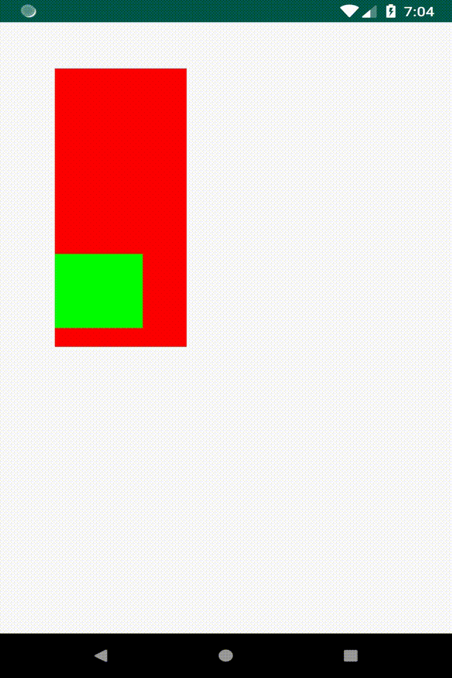

在Android UI开发中，对滑动事件的处理是不可少的，其中对View嵌套时的滑动冲突问题处理则相对比较麻烦，下面就介绍一个这样的案例。

## 滑动冲突问题

两个可以滑动的View嵌套，如何实现里面的View滑到尽头后，继续滑动时，事件交给外层View继续滑动。

## 问题分析

1. 根据Android的事件分发机制，里面的子view要想处理事件，就要接收到Action Down事件，所以父view不能拦截Down事件。
2. 父View要能处理后续的Move事件，那么他就需要拦截Move事件。
3. 子View滑动到尽头了，要交给父view，那么子View就需要能控制父View是否进行事件拦截。

## 解决思路

1. 父View不能拦截Down事件，但要拦截Move事件，可以在onInterceptTouchEvent中判断事件是Down事件时，返回false，其余事件返回true。
2. 子View在接收到Down事件时，需要调用父View的requestDisallowInterceptTouchEvent为false，让父View不拦截事件，那么子View可以处理后续的Move事件，实现子View滑动。
3. 当子View滑动到尽头后，再调用父View的requestDisallowInterceptTouchEvent为true，让父View拦截事件，即事件交给父View处理。

## 代码

### 父View

```java

@Override
public boolean onInterceptTouchEvent(MotionEvent ev) {
    // Down事件要流到子view，由子view判断是否需要父view拦截
    if (ev.getAction() == MotionEvent.ACTION_DOWN) {
        return false;
    } else {
        return true;
    }
}

private float rowY = -1;

@Override
public boolean onTouchEvent(MotionEvent event) {
    Log.d("Taolin", "parent onTouchEvent "  + event);
    switch (event.getAction()) {
        case MotionEvent.ACTION_DOWN: {
            LayoutParams l = (LayoutParams) getLayoutParams();
            // 计算当前位置离父view顶部的距离
            rowY = event.getRawY() - l.topMargin;
            break;
        }

        case MotionEvent.ACTION_MOVE: {
            LayoutParams l = (LayoutParams) getLayoutParams();
            if (rowY == -1) {
                // 从子view给过来的后续事件，不包含Down，所以这里要初始化一下
                rowY = event.getRawY() - l.topMargin;
            }
            // 当前位置减去距离顶部的距离，就是marginTop
            l.topMargin = (int)(event.getRawY() - rowY);
            setLayoutParams(l);
            break;
        }

        case MotionEvent.ACTION_UP:
        case MotionEvent.ACTION_CANCEL:
            // 事件结束的时候要把坐标还原，否则影响下次事件
            rowY = - 1;
            break;

        default:break;

    }
    return true;
}
```

### 子View

```java

private float rowY;
private float lastY;

@Override
public boolean onTouchEvent(MotionEvent event) {
    Log.d("Taolin", "child onTouchEvent "  + event);
    switch (event.getAction()) {
        case MotionEvent.ACTION_DOWN: {
            getParent().requestDisallowInterceptTouchEvent(true);
            FrameLayout.LayoutParams l = (FrameLayout.LayoutParams) getLayoutParams();
            // 计算当前位置离父view顶部的距离
            rowY = event.getRawY() - l.topMargin;
            lastY = event.getRawY();
            return true;
        }

        case MotionEvent.ACTION_MOVE: {
            FrameLayout.LayoutParams l = (FrameLayout.LayoutParams) getLayoutParams();
            float currentY = event.getRawY();
            float marginTop = l.topMargin;
            if (marginTop < 0) {
                if (lastY > currentY) {
                    // 滑到顶部了，继续往上滑就交给父view
                    getParent().requestDisallowInterceptTouchEvent(false);
                    return false;
                }
            } else if (marginTop > 500) {
                if (lastY < currentY) {
                    // 滑到底部了，继续往下滑就交给父view
                    getParent().requestDisallowInterceptTouchEvent(false);
                    return false;
                }
            }
            // 当前位置减去距离顶部的距离，就是marginTop
            l.topMargin = (int)(currentY - rowY);
            lastY = currentY;
            setLayoutParams(l);
            return true;
        }

        case MotionEvent.ACTION_CANCEL:
        case MotionEvent.ACTION_UP:
            getParent().requestDisallowInterceptTouchEvent(false);
            break;

        default:break;
    }
    return false;
}

```

## 实现效果



具体代码见：[https://github.com/taolin2107/SlideConflict](https://github.com/taolin2107/SlideConflict)
